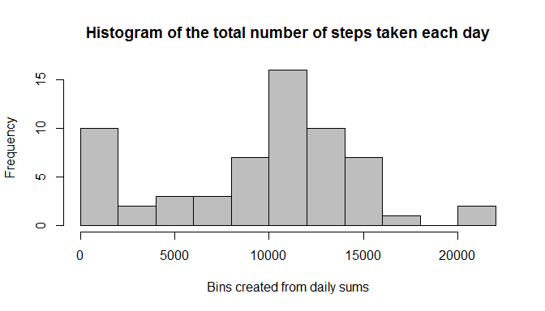
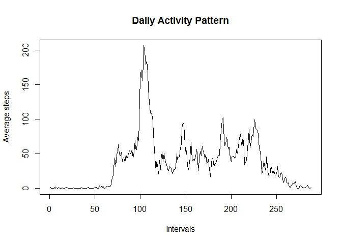
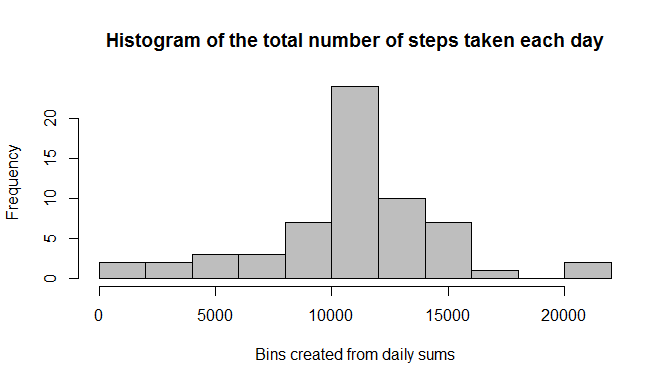
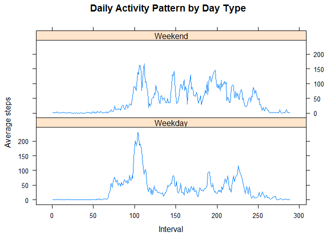

# Reproducible Research: Peer Assessment 1
rolandhazy  
16.10.2016  


## Loading and preprocessing the data

I load the data connecting to the zipped file with `unz` and then use `read.csv`.

```r
activity = read.csv(unz("activity.zip", "activity.csv"), stringsAsFactors = F)
```

Next I convert the `date` and `interval` columns into a date and factor class respectively. I use the `lubridate` package for dealing with dates.

```r
library(lubridate)
activity$date = ymd(activity$date)
activity$interval = factor(activity$interval)
```

## What is mean total number of steps taken per day?

1. Total number of steps taken per day. I use `tapply` to aggregate the steps per day ignoring missing values as directed.

```r
daily_sums = tapply(activity$steps, activity$date, function(x) sum(x, na.rm = T))
```

2. Histogram of daily sums using base plotting system.

```r
hist(daily_sums, main = "Histogram of the total number of steps taken each day",
     col = "grey", xlab = "Bins created from daily sums", breaks = 10)
```

<!-- -->

3. Mean and median of daily sums:

```r
mean_daily_sums = round(mean(daily_sums, na.rm = T), 2)
median_daily_sums = median(daily_sums, na.rm = T)
```
+ **mean** is 9354.23
+ **median** is 10395

## What is the average daily activity pattern?


```r
plot(tapply(activity$steps, activity$interval, function(x) mean(x, na.rm = T)),
     type = "l", ylab = "Average steps", xlab = "Intervals", main = "Daily Activity Pattern")
```

<!-- -->

## Imputing missing values

1. We can check NAs with `summary`.

```r
summary(activity)
```

```
##      steps             date               interval    
##  Min.   :  0.00   Min.   :2012-10-01   0      :   61  
##  1st Qu.:  0.00   1st Qu.:2012-10-16   5      :   61  
##  Median :  0.00   Median :2012-10-31   10     :   61  
##  Mean   : 37.38   Mean   :2012-10-31   15     :   61  
##  3rd Qu.: 12.00   3rd Qu.:2012-11-15   20     :   61  
##  Max.   :806.00   Max.   :2012-11-30   25     :   61  
##  NA's   :2304                          (Other):17202
```
Only `steps` column has missing values, altogether **2304**.

2. I will impute the missing values with the interval means. First I used the medians but it gave very low values.Also, using mean or median of that day wouldn't work as some days have too many NAs (the whole first day is missing).

3. Creating imputed dataset:

```r
interval_means = aggregate(activity$steps, by = list(interval = activity$interval),
                             FUN = function(x) mean(x, na.rm = T))
imputed_activity = merge(activity, interval_means, by = "interval", all.x = T)
imputed_activity[is.na(imputed_activity$steps), 2] = imputed_activity[is.na(imputed_activity$steps), 4]
imputed_activity = imputed_activity[, -4]
```

Checking `summary` of imputed dataset:

```r
summary(imputed_activity)
```

```
##     interval         steps             date           
##  0      :   61   Min.   :  0.00   Min.   :2012-10-01  
##  5      :   61   1st Qu.:  0.00   1st Qu.:2012-10-16  
##  10     :   61   Median :  0.00   Median :2012-10-31  
##  15     :   61   Mean   : 37.38   Mean   :2012-10-31  
##  20     :   61   3rd Qu.: 27.00   3rd Qu.:2012-11-15  
##  25     :   61   Max.   :806.00   Max.   :2012-11-30  
##  (Other):17202
```
4. Reproduce histogram with new dataset:

```r
daily_imputed_sums = tapply(imputed_activity$steps, imputed_activity$date, function(x) sum(x, na.rm = T))
hist(daily_imputed_sums, main = "Histogram of the total number of steps taken each day",
     col = "grey", xlab = "Bins created from daily sums", breaks = 10)
```

<!-- -->

5. Reproduce mean and median calculations:

```r
mean_daily_sums = round(mean(daily_imputed_sums, na.rm = T), 2)
median_daily_sums = median(daily_imputed_sums, na.rm = T)
```
+ **mean** is 10766.19
+ **median** is 10766.19

The mean and median became slighter higher and are equal while the histogram looks much better.

## Are there differences in activity patterns between weekdays and weekends?

1. Create new factor variable "Weekday" and "Weekend":

```r
imputed_activity$day_type = wday(imputed_activity$date, label = T)
imputed_activity$day_type = factor(
  ifelse(imputed_activity$day_type %in% c("Sat", "Sun"), "Weekend", "Weekday")
  )
```

2. Panel plot for "Weekday" and "Weekend"

```r
split_df = split(imputed_activity, imputed_activity$day_type)
split_df_mean = lapply(split_df, function(x) 
  aggregate(x$steps, by = list(interval = x$interval, day_type = x$day_type), FUN = mean))
activity_mean_new = rbind(split_df_mean$Weekday, split_df_mean$Weekend)
library(lattice)
xyplot(x~as.integer(interval)|day_type, activity_mean_new, type = 'l', layout=c(1,2),
       main = "Daily Activity Pattern by Day Type", xlab = "Interval", ylab = "Average steps")
```

<!-- -->

